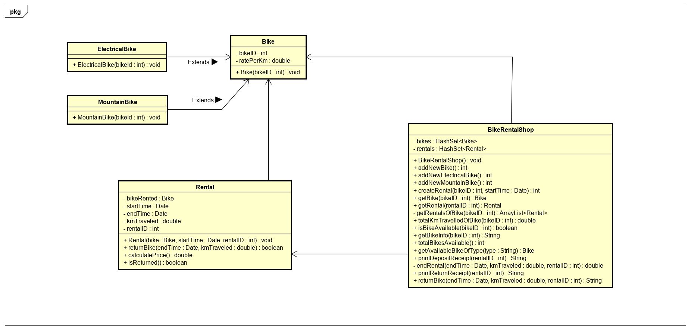

# Start document Bicycle Rental
Start document of **Thomas Koops**. Student number **1396796**.
## Problem Description
This project involves creating software to track the rental of bicycles. 
Customers should be able to rent bikes for a price.
The price is dependent on the amount of hours rented, distance traveled and type of bike used. 

**Pricing:**

The customer pays €20,- up front as a deposit.
The bikes come in three types each with a different rate per kilometre: 
regular bike (€0,20/km), mountain bike (€0,25/km) and electrical bike (€0,50/km). 
Per hour rented the customer has to pay €2,00. 

**Requirements:**
* The rental company wants to keep track of the amount of bikes available
* The rental company wants the price the customer has to pay automatically calculated
* The rental company wants to keep track of the distance each bike has been used 

###Input & Output

####Input
|Case|Type|Conditions|
|----|----|----------|
|Bike type|String|Can either be "regular", "mountain" or "electrical", not null|
|Start time|Date|after 1970-01-01 00:00:00, not null|
|End time|Date|Later than start time, not null|
|Km traveled|double|Higher than or equal to 0|
|Rental id|int|Higher than or equal to 0| 
|Bike id|int|Higher than or equal to 0|

####Output
|Case|Type|
|----|----|
|Bikes currently available| int|
|First bike of a type that is available| Bike|
|Kms a bike has travelled| double|
|Availability of bike| boolean|
|Get bike info| String |
|Price of rental| double|
|Deposit receipt|String|
|Return receipt|String|

**Remarks**

* Input will be validated
* Only the Main class will contain System.out.println
* Unit tests will be provided
* New Bike and Rental objects will be created by methods in BikeRentalShop to ensure all bikes and rentals are added to the HashMaps.
* Prices are rounded to two decimals

## Testplan
In this section the testcases will be described to test the application. 
Sequences are used inside testcases to avoid duplicate steps and are executed when mentioned inside the action of a testcase. 

### Sequence #1
**Creates a bike of each type**

|Step|Input|Action|Expected output|
|----|-----|------|---------------
|1|none|addNewBike()|0|
|2|none|addNewMountainBike()|1|
|3|none|addNewElectricalBike()|2|
|4|none|addNewBike()|3|

### Sequence #2
**Creates a rental of each type of bike**

|Step|Input|Action|Expected output|
|----|-----|------|---------------
|1|Type: "regular", Date: 6-10-2020 10:00:00|getAvailableBikeOfType(), createRental()|0|
|2|Type: "mountain", Date: 7-10-2020 11:00:00|getAvailableBikeOfType(), createRental()|1|
|3|Type: "electrical", Date: 8-10-2020 12:00:00|getAvailableBikeOfType(), createRental()|2|
|4|Type: "regular", Date: 9-10-2020 13:00:00|getAvailableBikeOfType(), createRental()|3|

### Testcase #1
**Bike availability test**

|Step|Input|Action|Expected output|
|----|-----|------|---------------|
|1|none|totalBikesAvailable()|0|
|2|Type: "regular"|getAvailableBikeOfType()|null|
|3|none|Sequence #1| none|
|4|Type: "regular"|getAvailableBikeOfType()|not null|
|5|Type: "mountain"|getAvailableBikeOfType()|not null|
|6|Type: "electrical"|getAvailableBikeOfType()|not null|
|7|none|totalBikesAvailable()|4|

### Testcase #2
**Bike info test**

|Step|Input|Action|Expected output|
|----|-----|------|---------------|
|1|none|Sequence #1| none|
|2|Bike ID: 0|getBikeInfo()|"Type: Regular, Total km traveled: 0, Is available: Yes"|
|3|Bike ID: 1|getBikeInfo()|"Type: Mountain, Total km traveled: 0, Is available: Yes"|
|4|Bike ID: 2|getBikeInfo()|"Type: Electrical, Total km traveled: 0, Is available: Yes"|

### Testcase #3
**Test ending rentals**

|Step|Input|Action|Expected output|
|----|-----|------|---------------|
|1|Date: 6-10-2020 09:00:00, Km traveled: 10, Rental ID: 0|returnBike()| "Error: rental ID does not exist"|
|2|Rental ID: 0|printDepositReceipt()| "Error: rental ID does not exist"|
|3|Rental ID: 0|printReturnReceipt()| "Error: rental ID does not exist"|
|4|none|Sequence #1|none|
|5|none|Sequence #2|none|
|6|Rental ID: 0|printDepositReceipt()| "Regular bike rented. The customer has to pay a €20,- deposit"|
|7|Rental ID: 0|printReturnReceipt()| "Error: bike has not yet been returned"|
|8|Rental ID:0|endRental()| -1|
|9|Date: 6-10-2020 09:00:00, Km traveled: 1.0, Rental ID: 0| returnBike()| "Error: end date can't be before start date" |
|10|Date: 6-10-2020 12:00:00, Km traveled: -1.5, Rental ID: 0| returnBike()| "Error: negative values for Km traveled is not allowed| |
|11|Date: 6-10-2020 12:00:00, Km traveled: 1.0, Rental ID: 0| returnBike()| "Bike has been successfully returned. The customer has to pay €4.20."|
|12|Date: 6-10-2020 12:00:00, Km traveled: 1.0, Rental ID: 0| returnBike()| "Error: rental already ended."|
|13|Date: 7-10-2020 12:00:00, Km traveled: 3.0, Rental ID: 1| returnBike()| "Bike has been successfully returned. The customer has to pay €2.75."|
|14|Date: 8-10-2020 12:30:00, Km traveled: 5.0, Rental ID: 2| returnBike()| "Bike has been successfully returned. The customer has to pay €3.50."|
|15|Date: 9-10-2020 13:00:00, Km traveled: 0.0, Rental ID: 3| returnBike()| "Bike has been successfully returned. The customer has to pay €0.00." |
|16|Rental ID: 0|printReturnReceipt()| "The customer has to pay €4.20."|

### Testcase #3
**Test availability during and after rentals**

|Step|Input|Action|Expected output|
|----|-----|------|---------------|
|1|none|Sequence #1|none|
|2|none|Sequence #2|none|
|3|none|totalBikesAvailable()|0|
|4|Type: "Regular"|getAvailableBikeOfType()|null|
|5|Bike ID: 0|getBikeInfo()|"Type: Regular, Total km traveled: 0, Is available: No"|
|6|Date: 6-10-2020 12:00:00, Km traveled: 1.0, Rental ID:0| returnBike()| "Bike has been successfully returned. The customer has to pay €4.20."|
|7|none|totalBikesAvailable()|1|
|8|Bike ID: 0|getBikeInfo()|"Type: Regular, Total km traveled: 1.0, Is available: Yes"|

### Testcase #4
**Test multiple rentals of same bike at different times**

|Step|Input|Action|Expected output|
|----|-----|------|---------------|
|1|none|Sequence #1|none|
|2|none|Sequence #2|none|
|3|Date: 6-10-2020 12:00:00, Km traveled: 1.5, Rental ID:0| returnBike()| "Bike has been successfully returned. The customer has to pay €4.20."|
|4|Bike ID: 0| getBike(), getTotalKmTraveled()| 1.5|
|5|Type: "regular", Date: 7-10-2020 10:00:00|getAvailableBikeOfType(), createRental()|0|
|6|Date: 7-10-2020 12:00:00, Km traveled: 3.5, Rental ID:0| returnBike()| "Bike has been successfully returned. The customer has to pay €4.20."|
|7|Bike ID: 0| getTotalKmTraveled()| 5.0|

### Testcase #5
**Test multiple rentals of same bike at the same time**

|Step|Input|Action|Expected output|
|----|-----|------|---------------|
|1|none|Sequence #1|none|
|2|none|Sequence #2|none|
|3|Bike ID: 0, Date: 7-10-2020 10:00:00|createRental()| "Error: bike is already taken"|
|4|Bike ID: 0, Date: 7-10-2020 10:00:00|getBike(), new Rental()| BikeNotAvailableException|

## UML

